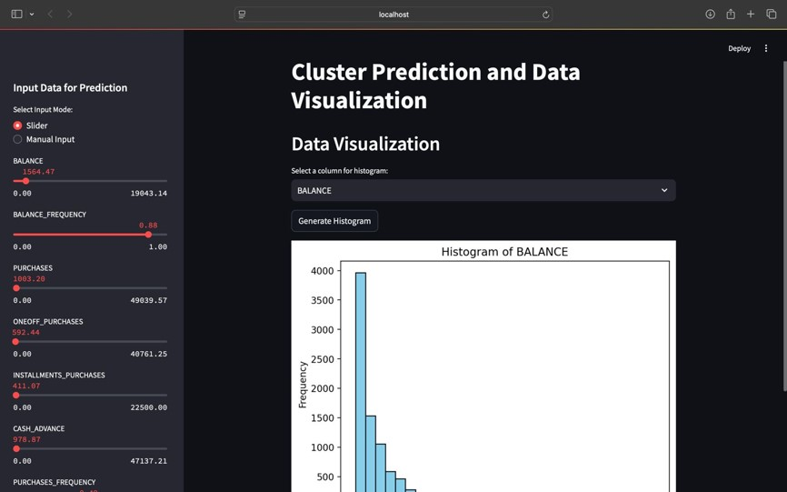

# Market Segmentation and Analysis (ML)

### Objective  :
The primary aim of such a project is to identify distinct customer segments based on their behaviours, preferences, and demographics. By understanding these segments, businesses can tailor their marketing strategies, product offerings, and customer experiences to better meet the specific needs of each group.

<br>
  
<br>

## Collab Link
[Market Segmentation and Analysis using ML](https://colab.research.google.com/drive/1ozQpwtUEXncnWXd-zOuSkUuRNtSucGnE?authuser=1)

### Data Description : 
The sample Dataset summarizes the usage behavior of about 9000 active credit card holders during the last 6 months. The file is at a customer level with 18 behavioral variables.
### Data :  
Use the below link to download the Data Set:[here](https://github.com/toranvathani/MarketSegmentationandAnalysisML/blob/master/Clustered_Customer_Data.csv) 
### Algorithms used :  
In this dataset i've used five clustering algorithm to perform segmentation.These algorithms are given below.
- [K-Means Clustering](https://en.wikipedia.org/wiki/K-means_clustering)
- [Agglomerative Clustering](https://scikit-learn.org/stable/modules/generated/sklearn.cluster.AgglomerativeClustering.html)
- [Spectral Clustering](https://scikit-learn.org/stable/modules/generated/sklearn.cluster.SpectralClustering.html)
- [DBSCAN Clustering](https://scikit-learn.org/stable/modules/generated/sklearn.cluster.DBSCAN.html)
- [GaussianMixture Model based clustering](https://en.wikipedia.org/wiki/Mixture_model)
### Final Model  :
Created a Streamlit Application based on this clustering technique, where we are taking the customer details & identifying which cluster the custoemr belongs to.
<br>
  
<br>

## Author 
```
Toran V Athani
```
